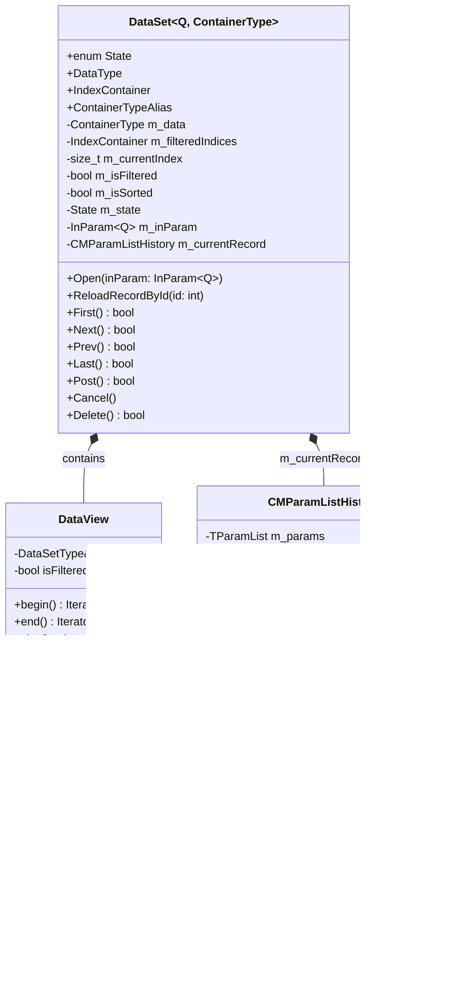

# DataSet и ParamList в MERP

## Общее описание

В проекте MERP классы `DataSet` и `CMParamList` являются ключевыми компонентами для работы с данными. Они обеспечивают типобезопасную работу с наборами данных и параметрами.

## DataSet

### Назначение
Шаблонный класс для управления наборами данных с поддержкой просмотра, редактирования, фильтрации и сортировки.

### Шаблонные параметры
- `Q`: Тип запроса (из перечисления `Querys`)
- `ContainerType`: Тип контейнера (по умолчанию `std::vector`)

### Состояния (`State`)
- `Inactive`: Неактивное состояние
- `Browsing`: Режим просмотра
- `Editing`: Режим редактирования

### Основные методы

#### Навигация
```cpp
bool First()  // Переход к первой записи
bool Next()   // Переход к следующей записи
bool Prev()   // Переход к предыдущей записи
bool Last()   // Переход к последней записи
bool SetActiveByID(int id)  // Установка активной записи по ID
```

#### Управление данными
```cpp
void Open(const InParam<Q>& inParam = InParam<Q>{})  // Открытие набора данных
void ReloadRecordById(int id)  // Перезагрузка записи по ID
bool Post()  // Сохранение изменений
void Cancel()  // Отмена изменений
bool Delete()  // Удаление текущей записи
```

### Сигналы
- `onRecordScroll`: Сигнал прокрутки записи
- `onRecordUpdated`: Сигнал обновления записи
- `onRecordDeleted`: Сигнал удаления записи
- `onDataSetRefreshed`: Сигнал обновления набора данных

### Внутренний класс DataView
Предоставляет отфильтрованное или неотфильтрованное представление данных:
- Поддержка итераторов
- Доступ по индексу
- Константные и неконстантные версии

## CMParamList

### Назначение
Именованный список параметров для передачи между компонентами системы.

### Основные возможности

#### Управление параметрами
```cpp
void SetParam(const std::string& key, const std::any& value)
template<typename T> T GetParam(const std::string& key)
bool HasParam(const std::string& key) const
void RemoveParam(const std::string& key)
void clear()
```

#### Валидация и коллбэки
```cpp
void SetValidateParamCallback(ValidateParamCallback cb)
void SetValidateParamsCallback(ValidateParamsCallback cb)
void SetBeforeSaveCallback(SaveCallback cb)
void SetOnSaveCallback(SaveCallback cb)
```

### CMParamListHistory
Расширение CMParamList с поддержкой истории изменений:
- Транзакционность (Commit/Undo)
- Отслеживание изменений
- Управление состоянием сохранения

## Примеры использования

### Работа с DataSet
```cpp
DataSet<Querys::some_query> ds;
ds.SetParams(someParams);
ds.Open();

// Навигация
ds.First();
while (ds.Next()) {
    // Обработка записей
}

// Редактирование
if (ds.SetActiveByID(someId)) {
    // Изменение текущей записи
    if (ds.Post()) {
        // Успешное сохранение
    }
}
```

### Работа с CMParamList
```cpp
CMParamList params;
params.SetParam("param_name_1", std::string("value1"));
params.SetParam("param_name_2", 123.45);

// Проверка наличия параметра
if (params.HasParam("param_name_1")) {
    auto value = params.GetParam<std::string>("param_name_1");
}

// Использование с историей
CMParamListHistory paramHistory;
paramHistory.SetNewParam("key", "value");
paramHistory.Commit();  // Фиксация изменений
```

## Взаимодействие с UI

### GridDataSource
- Использует DataSet для отображения данных в табличном виде
- Поддерживает режимы чтения и редактирования
- Обрабатывает навигацию по записям

### TreeDataSource
- Использует DataSet для отображения иерархических данных
- Поддерживает развертывание/свертывание узлов
- Обрабатывает события дерева

## Диаграмма классов



## Особенности реализации

### Типобезопасность
- Шаблонный дизайн обеспечивает типобезопасность на этапе компиляции
- Поддержка различных типов контейнеров
- Безопасная работа с параметрами через `std::any`

### Производительность
- Эффективная работа с большими наборами данных
- Оптимизированная фильтрация и сортировка
- Минимизация копирования данных

### Расширяемость
- Поддержка пользовательских типов данных
- Возможность добавления новых функций через коллбэки
- Гибкая система сигналов