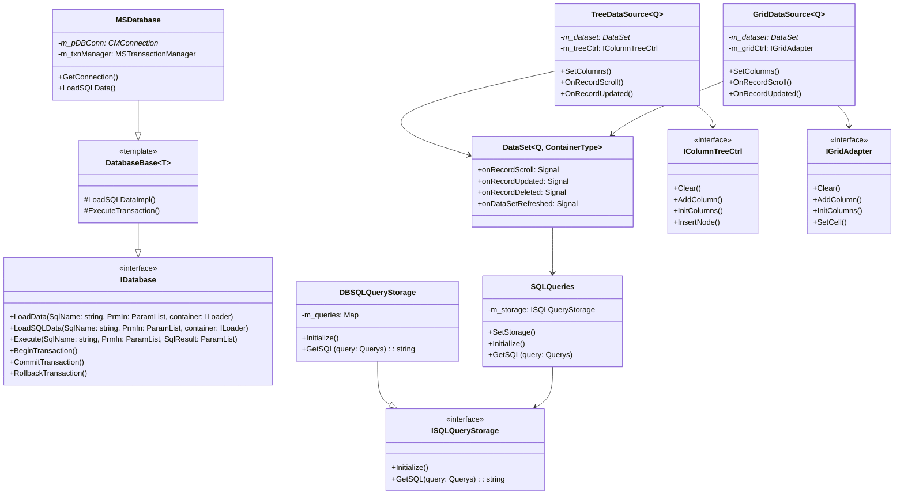

# Архитектура доступа к данным в MERP

## Общая структура



## Основные компоненты

### 1. Уровень работы с базой данных
- **IDatabase**: Базовый интерфейс для операций с БД
- **DatabaseBase**: Шаблонный базовый класс с общей функциональностью БД
- **MSDatabase**: Конкретная реализация для MS SQL Server
- **MSTransactionManager**: Управление транзакциями БД

### 2. Уровень доступа к данным
- **DataSet<Q, ContainerType>**: Универсальный контейнер для управления данными:
  - Навигация по записям
  - Отслеживание изменений данных
  - Сигнализация о событиях
  - Фильтрация и сортировка

### 3. Управление SQL-запросами
- **SQLQueries**: Центральный менеджер SQL-запросов
- **ISQLQueryStorage**: Интерфейс хранилища запросов
- **DBSQLQueryStorage**: Реализация хранилища запросов в БД
- **SQLStringBuilder**: Утилита для построения SQL-строк

### 4. Привязка данных к UI
- **TreeDataSource**: Связывание данных с древовидными контролами
- **GridDataSource**: Связывание данных с табличными контролами
- **IColumnTreeCtrl**: Интерфейс для древовидных представлений
- **IGridAdapter**: Интерфейс для табличных представлений

### 5. Конфигурация
- **DatabaseConfig**: Настройки подключения к БД
- **ParamList**: Управление параметрами запросов

## Принципы архитектуры

1. **Разделение ответственности**: 
   - Четкое разделение между доступом к БД
   - Управление данными
   - Представление в UI

2. **Типобезопасность**: 
   - Активное использование шаблонов
   - Строгая типизация параметров запросов

3. **Событийная модель**: 
   - Механизм сигналов/слотов для оповещения об изменениях данных

4. **Абстракция**: 
   - Дизайн на основе интерфейсов
   - Возможность множественных реализаций

5. **Переиспользование**: 
   - Универсальные компоненты для разных типов данных

## Преимущества архитектуры

1. **Безопасность типов**:
   - Типобезопасные операции с БД
   - Контроль на этапе компиляции

2. **Эффективная привязка к UI**:
   - Автоматическое обновление представлений
   - Единый интерфейс для разных типов контролов

3. **Управление транзакциями**:
   - Надежное управление транзакциями
   - Автоматический откат при ошибках

4. **Гибкость запросов**:
   - Централизованное хранение запросов
   - Легкое управление и модификация

5. **Расширяемость**:
   - Простое добавление новых типов данных
   - Легкая интеграция новых UI-компонентов

## Использование

### Пример работы с DataSet

```cpp
// Создание набора данных
DataSet<Querys::file_list_s> dataSet;

// Подключение обработчиков событий
dataSet.onRecordUpdated.connect([](const auto& record) {
    // Обработка обновления записи
});

// Загрузка данных
dataSet.LoadData();
```

### Пример привязки к UI

```cpp
// Создание источника данных для таблицы
auto gridSource = std::make_unique<GridDataSource<Querys::file_list_s>>(
    &dataSet, 
    gridAdapter
);

// Настройка колонок
std::vector<TGridColumnConfig> columns = {
    {L"FileID", L"ID файла", LVCFMT_RIGHT, 5.f},
    {L"FileName", L"Имя файла", LVCFMT_LEFT, 30.f}
};
gridSource->SetColumns(columns);
```

## Рекомендации по разработке

1. **Создание новых запросов**:
   - Добавить запрос в `SQLQueries.h`
   - Создать структуры параметров в соответствующем `[Модуль]SQL.h`
   - Реализовать провайдер данных

2. **Работа с UI**:
   - Использовать готовые адаптеры `GridDataSource` и `TreeDataSource`
   - При необходимости создавать новые адаптеры

3. **Обработка ошибок**:
   - Использовать механизм исключений
   - Обеспечивать корректный откат транзакций

4. **Оптимизация**:
   - Использовать подготовленные запросы
   - Правильно управлять жизненным циклом транзакций

## Связанные материалы

- [[Схема базы данных MERP]]
- [[SQL запросы MERP]]
- [[UI контролы MERP]]

#архитектура #база_данных #документация