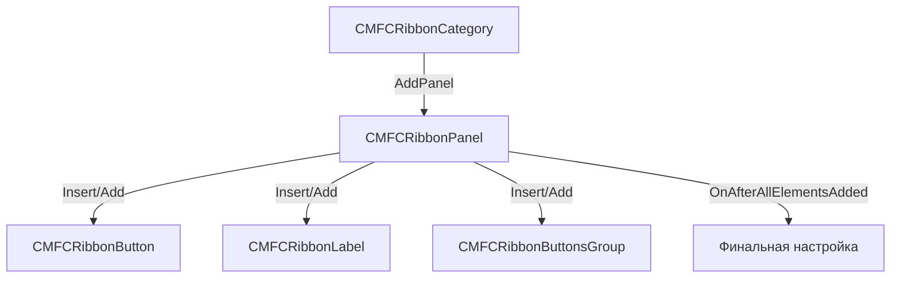

# CMFCRibbonPanel - Панель элементов в ленте

## Общее описание

`CMFCRibbonPanel` - это компонент, представляющий собой панель в ленте (Ribbon) приложения. Панель служит контейнером для различных элементов управления, таких как кнопки, метки, группы кнопок и другие элементы интерфейса.

## Создание панели

### Базовое создание
```cpp
CMFCRibbonPanel* pPanel = pCategory->AddPanel(L"Название панели", 0);
ASSERT(pPanel);
```

### Полный пример создания панели с элементами
```cpp
void AddPanelWithButtons(CMFCRibbonCategory* pCategory) {
    bool bVal;
    CMFCRibbonPanel* pPanel;
    CMFCRibbonButton* pButton;
    CString Str;
    UINT uiID;
    int iOrdinal = 0;

    // Создание панели
    pPanel = pCategory->AddPanel(L"Название панели", 0);
    ASSERT(pPanel);

    // Добавление кнопок
    uiID = ID_BUTTON1;
    Str.LoadString(uiID);
    pButton = new CMFCRibbonButton(uiID, Str, -1, +eRbnButtonPicID::Create);
    bVal = pPanel->Insert(pButton, iOrdinal++);
}
```

## Основные методы

1. **Добавление элементов**:
   - `Insert()` - вставка элемента в определенную позицию
   - `Add()` - добавление элемента в конец панели

2. **Навигация**:
   - `GetCount()` - получение количества элементов
   - `GetElement()` - получение элемента по индексу
   - `FindByID()` - поиск элемента по ID
   - `GetName()` - получение имени панели

## Типы добавляемых элементов

### 1. Кнопки (CMFCRibbonButton)
```cpp
CMFCRibbonButton* pButton = new CMFCRibbonButton(uiID, strButtonText, smallImageIndex, largeImageIndex);
pPanel->Insert(pButton, ordinalPosition);
```

### 2. Группы кнопок (CMRibbonButtonsGroup)
```cpp
CMRibbonButtonsGroup* pGroup = new CMRibbonButtonsGroup;
pPanel->Add(pGroup);
```

### 3. Метки (CMRibbonLabel)
```cpp
CMRibbonLabel* pLabel = new CMRibbonLabel(strLabelText);
pPanel->Add(pLabel);
```

## Архитектура взаимодействия



## Пример использования в селекторах

```cpp
bool CMSelectorCombo::Init(SSetupRibbon &SetupRibbon) {
    // Создание группы кнопок
    CMRibbonButtonsGroup* pSBGroup = new CMRibbonButtonsGroup;
    
    // Создание кнопок
    CMRibbonButton* pCreateButton = new CMRibbonButton(m_uiCreateBtn, "", 
        +eRbnButtonSmallPicID::Insert, -1, 0);
    
    // Добавление метки
    CMRibbonLabel* pLabel = new CMRibbonLabel(m_pRibbonCombo->GetText() + L" ");
    
    // Добавление в панель
    SetupRibbon.m_pPanel->Add(pSBGroup);
}
```

## Важные особенности

1. **Контейнер элементов**:
   - Является контейнером для различных элементов ленты
   - Поддерживает разные типы элементов управления
   - Автоматически управляет размещением

2. **Визуальный стиль**:
   - Встроенная поддержка визуальных стилей
   - Согласованность с общим стилем приложения

3. **Управление памятью**:
   - Необходимо освобождать память для динамически созданных элементов
   - Важно следить за жизненным циклом объектов

## Рекомендации по использованию

1. **Проверки**:
   - Всегда проверяйте результат создания через ASSERT
   - Проверяйте корректность указателей

2. **Порядок элементов**:
   - Используйте ordinal для правильного порядка
   - Поддерживайте логическую группировку

3. **Именование**:
   - Используйте понятные имена панелей
   - Следуйте общим конвенциям проекта

4. **Производительность**:
   - Создавайте элементы только когда необходимо
   - Избегайте излишней динамической генерации

## Управление состоянием элементов

### 1. Активация/Деактивация элементов

```cpp
// Через CCmdUI в обработчиках ON_UPDATE_COMMAND_UI
void OnUpdateElement(CCmdUI* pCmdUI)
{
    pCmdUI->Enable(bEnabled); // Включение/выключение элемента
}

// Напрямую через методы элемента
CMFCRibbonButton* pButton = ...
pButton->MEnable(bEnabled); // Специальный метод для управления доступностью
pButton->SetMVisible(bVisible); // Управление видимостью
```

### 2. Обновление состояния
```cpp
// Обновление изображения кнопки
void SetImageForRibBtn({
    CMFCRibbonButton* pBtn,
    int imageId,
    bool newState,
    bool* currentState
});

// Обновление текста
pButton->SetText(newText);
```

## Обработка событий

### 1. События элементов

```cpp
// В карте сообщений
BEGIN_MESSAGE_MAP(CMyView, CView)
    ON_COMMAND(ID_BUTTON, OnButtonClick)           // Клик по кнопке
    ON_UPDATE_COMMAND_UI(ID_BUTTON, OnUpdateButton) // Обновление состояния
    ON_CBN_SELENDOK(ID_COMBO, OnComboSelectionEnd) // Выбор в комбо
    ON_COMMAND(ID_CHECKBOX, OnCheckBoxChange)      // Изменение чекбокса
END_MESSAGE_MAP()
```

### 2. События комбо-бокса
```cpp
// Обработка изменения текста
void OnEditChange();

// Обработка выбора элемента
void OnSelectItem(int nItem);

// Перед открытием выпадающего списка
void DropDownList();
```

### 3. События панели
```cpp
// После добавления всех элементов
void OnAfterAllElementsAdded(CWnd* pWnd);

// При изменении размера
void OnAfterChangeRect(CDC* pDC);
```

### 4. Пример полной обработки
```cpp
class CMyView : public CView {
    // Обработчик клика
    void OnButtonClick() {
        // Действия при клике
    }

    // Обработчик обновления состояния
    void OnUpdateButton(CCmdUI* pCmdUI) {
        pCmdUI->Enable(CanExecuteAction());
    }

    // Обработчик выбора в комбо
    void OnComboSelectionEnd() {
        // Действия при выборе
    }
};
```

## Связанные компоненты

- `CMFCRibbonCategory` - категория в ленте
- `CMFCRibbonButton` - кнопка
- `CMRibbonButtonsGroup` - группа кнопок
- `CMRibbonLabel` - метка
- `CMFCRibbonBar` - главная лента приложения