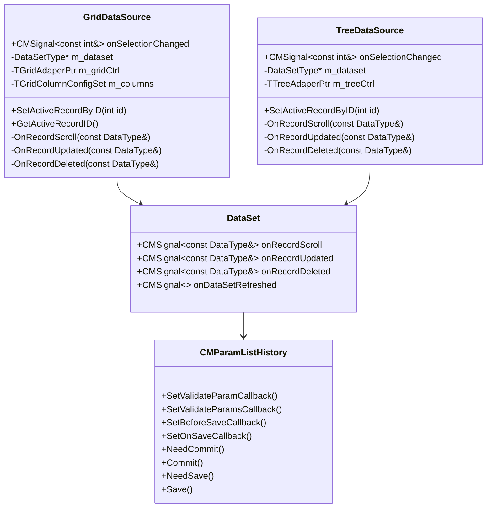

# DataSource

## Общее описание
DataSource представляет собой компонент, обеспечивающий связь между источником данных (DataSet) и UI-элементами (Grid и Tree). Реализован в двух вариантах: `GridDataSource` и `TreeDataSource`.

## Основные возможности
- Связывание данных с UI-контролами
- Обработка событий выделения записей
- Синхронизация состояния данных между DataSet и UI
- Поддержка обновления UI при изменении данных

## Структура классов

### GridDataSource


## Система колбэков и сигналов

### Сигналы DataSource
1. `onSelectionChanged` - изменение выделенной записи в UI
   ```cpp
   CMSignal<const int&> onSelectionChanged;
   ```

### Обработка событий от DataSet
1. Прокрутка записей:
   ```cpp
   m_dataset->onRecordScroll.connect([this](const DataType &record) { 
       OnRecordScroll(record); 
   });
   ```

2. Обновление записей:
   ```cpp
   m_dataset->onRecordUpdated.connect([this](const DataType &record) { 
       OnRecordUpdated(record); 
   });
   ```

3. Удаление записей:
   ```cpp
   m_dataset->onRecordDeleted.connect([this](const DataType &record) { 
       OnRecordDeleted(record); 
   });
   ```

4. Обновление набора данных:
   ```cpp
   m_dataset->onDataSetRefreshed.connect([this]() { 
       OnDataSetRefreshed(); 
   });
   ```

## Взаимодействие с CMParamListHistory

### Основные точки взаимодействия
1. **Редактирование записи**
   - При начале редактирования DataSet создает новый экземпляр CMParamListHistory
   - Устанавливаются колбэки валидации и сохранения

2. **Валидация данных**
   ```cpp
   void ApplyCallbacksToCurrentRecord() {
       m_currentRecord.SetValidateParamCallback(m_validateParam);
       m_currentRecord.SetValidateParamsCallback(m_validateParams);
       m_currentRecord.SetBeforeSaveCallback(m_beforeSave);
       m_currentRecord.SetOnSaveCallback(m_onSave);
   }
   ```

3. **Процесс сохранения**
   - Проверка необходимости коммита: `NeedCommit()`
   - Выполнение коммита: `Commit()`
   - Проверка необходимости сохранения: `NeedSave()`
   - Сохранение изменений: `Save()`

## Примеры использования

### Создание GridDataSource
```cpp
auto gridSource = std::make_unique<GridDataSource<Querys::file_hist_s>>(
    &fileHistDataSet, 
    gridAdapter
);
gridSource->SetColumns(columns);
gridSource->Refresh();
```

### Подписка на изменение выделения
```cpp
gridSource->onSelectionChanged.connect([](const int& id) {
    // Обработка изменения выделения
});
```

## Рекомендации по использованию
1. Всегда устанавливайте колбэки валидации перед началом редактирования
2. Используйте сигналы для синхронизации состояния между компонентами
3. Обрабатывайте все события обновления данных для поддержания актуального состояния UI
4. При работе с CMParamListHistory учитывайте состояние транзакции (Commit/Save)

## Связанные материалы
- [[../Архитектура доступа к данным]]
- [[CMParamListHistory]]
- [[../UI контролы MERP]]