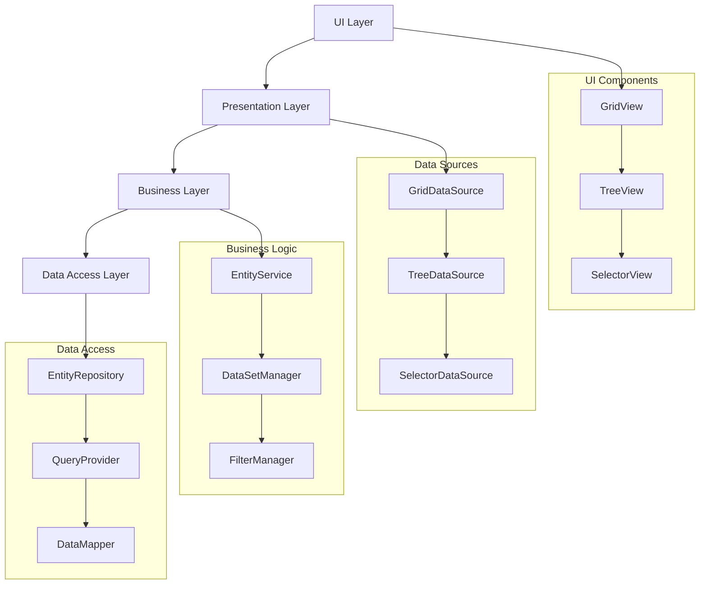
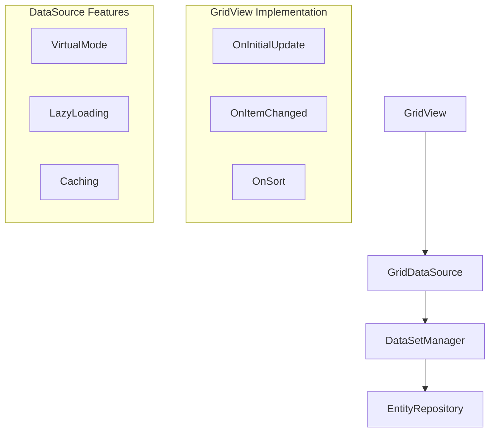
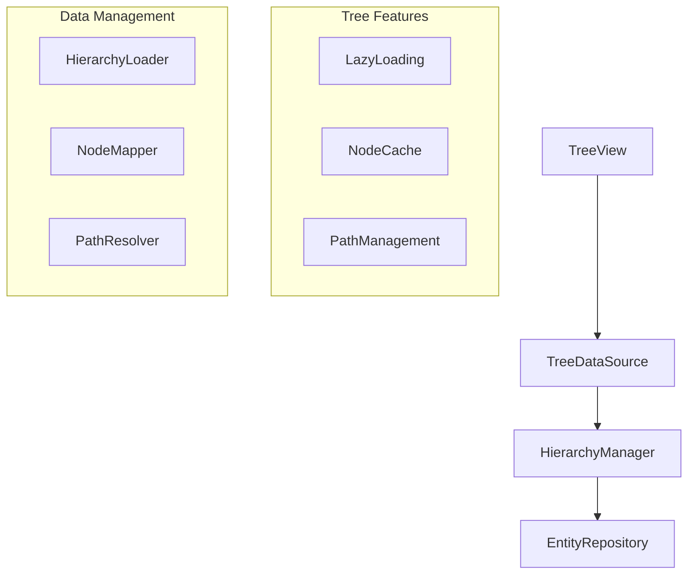

# Интеграция селекторов с Grid и Tree элементами

## Общая архитектура



## Унифицированный подход к данным

### 1. Общий интерфейс источника данных

```cpp
// Базовый интерфейс для всех источников данных
class IDataSource {
public:
    virtual void SetQuery(const IQuery& query) = 0;
    virtual void SetFilter(const IFilter& filter) = 0;
    virtual void SetSort(const ISort& sort) = 0;
    virtual void Refresh() = 0;
    virtual bool FetchData() = 0;
};

// Специализация для Grid
class IGridDataSource : public IDataSource {
public:
    virtual int GetRowCount() = 0;
    virtual int GetColumnCount() = 0;
    virtual CString GetCellValue(int row, int col) = 0;
    virtual void SetCellValue(int row, int col, const CString& value) = 0;
};

// Специализация для Tree
class ITreeDataSource : public IDataSource {
public:
    virtual bool HasChildren(const TreeNodeID& nodeId) = 0;
    virtual vector<TreeNodeID> GetChildren(const TreeNodeID& nodeId) = 0;
    virtual CString GetNodeText(const TreeNodeID& nodeId) = 0;
};
```

### 2. Единый механизм запросов

```cpp
// Построитель запросов
class QueryBuilder {
public:
    QueryBuilder& Select(const vector<string>& fields);
    QueryBuilder& From(const string& table);
    QueryBuilder& Where(const IFilter& filter);
    QueryBuilder& OrderBy(const vector<SortField>& sort);
    QueryBuilder& GroupBy(const vector<string>& fields);
    
    IQuery Build();
};

// Пример использования
auto query = QueryBuilder()
    .Select({"ID", "Name", "ParentID"})
    .From("Departments")
    .Where(Filter::Equal("Deleted", 0))
    .OrderBy({{"Name", SortOrder::Ascending}})
    .Build();
```

## Реализация для Grid



### Пример реализации Grid

```cpp
// Источник данных для Grid
class CGridDataSourceImpl : public IGridDataSource {
private:
    std::shared_ptr<IEntityRepository> m_repository;
    std::shared_ptr<IDataSetManager> m_dataManager;
    CacheManager m_cache;
    
public:
    // Реализация виртуального режима
    virtual CString GetCellValue(int row, int col) override {
        if (!m_cache.HasRow(row)) {
            FetchPage(row / PAGE_SIZE);
        }
        return m_cache.GetValue(row, col);
    }
    
    // Ленивая загрузка данных
    void FetchPage(int pageIndex) {
        auto query = m_currentQuery;
        query.SetPage(pageIndex, PAGE_SIZE);
        auto data = m_repository->Execute(query);
        m_cache.StorePage(pageIndex, data);
    }
};

// Использование в Grid View
class CCustomGridView : public CGridView {
private:
    std::shared_ptr<IGridDataSource> m_dataSource;
    
protected:
    void OnInitialUpdate() override {
        m_dataSource = std::make_shared<CGridDataSourceImpl>();
        m_dataSource->SetQuery(BuildInitialQuery());
        SetupColumns();
        EnableVirtualMode();
    }
    
    void OnGetCellValue(int row, int col, CString& value) override {
        value = m_dataSource->GetCellValue(row, col);
    }
};
```

## Реализация для Tree



### Пример реализации Tree

```cpp
// Источник данных для Tree
class CTreeDataSourceImpl : public ITreeDataSource {
private:
    std::shared_ptr<IEntityRepository> m_repository;
    std::shared_ptr<IHierarchyManager> m_hierarchyManager;
    NodeCache m_nodeCache;
    
public:
    virtual bool HasChildren(const TreeNodeID& nodeId) override {
        return m_hierarchyManager->HasChildren(nodeId);
    }
    
    virtual vector<TreeNodeID> GetChildren(const TreeNodeID& nodeId) override {
        if (!m_nodeCache.HasChildren(nodeId)) {
            LoadChildren(nodeId);
        }
        return m_nodeCache.GetChildren(nodeId);
    }
    
private:
    void LoadChildren(const TreeNodeID& nodeId) {
        auto query = QueryBuilder()
            .Select({"ID", "Name", "ParentID"})
            .From("Hierarchy")
            .Where(Filter::Equal("ParentID", nodeId))
            .Build();
            
        auto children = m_repository->Execute(query);
        m_nodeCache.StoreChildren(nodeId, children);
    }
};

// Использование в Tree View
class CCustomTreeView : public CTreeView {
private:
    std::shared_ptr<ITreeDataSource> m_dataSource;
    
protected:
    void OnInitialUpdate() override {
        m_dataSource = std::make_shared<CTreeDataSourceImpl>();
        LoadRootNodes();
    }
    
    void OnItemExpanding(HTREEITEM hItem) override {
        auto nodeId = GetNodeID(hItem);
        if (m_dataSource->HasChildren(nodeId)) {
            LoadChildNodes(hItem);
        }
    }
};
```

## Интеграция с селекторами

```cpp
// Селектор с поддержкой Grid/Tree
class CAdvancedSelector : public IMSelector {
private:
    std::shared_ptr<IDataSource> m_dataSource;
    std::shared_ptr<IDisplayView> m_view;
    
public:
    void SetViewMode(ViewMode mode) {
        switch (mode) {
            case ViewMode::Grid:
                m_view = std::make_shared<CGridView>();
                m_dataSource = std::make_shared<CGridDataSourceImpl>();
                break;
            case ViewMode::Tree:
                m_view = std::make_shared<CTreeView>();
                m_dataSource = std::make_shared<CTreeDataSourceImpl>();
                break;
        }
        m_view->SetDataSource(m_dataSource);
    }
    
    void ApplyFilter(const IFilter& filter) {
        m_dataSource->SetFilter(filter);
        m_dataSource->Refresh();
    }
};
```

## Ключевые преимущества подхода

1. **Унификация доступа к данным**
   - Единый интерфейс для разных типов отображения
   - Общий механизм запросов и фильтрации
   - Переиспользование компонентов

2. **Оптимизация производительности**
   - Виртуальный режим для больших наборов данных
   - Ленивая загрузка для деревьев
   - Кэширование данных

3. **Гибкость и расширяемость**
   - Легкое добавление новых типов отображения
   - Поддержка различных источников данных
   - Настраиваемое поведение

4. **Улучшенная поддержка**
   - Четкое разделение ответственности
   - Изолированные изменения
   - Упрощенное тестирование

## Рекомендации по внедрению

1. **Поэтапный переход**
   - Начать с базовой инфраструктуры
   - Постепенно переводить существующие компоненты
   - Сохранять обратную совместимость

2. **Оптимизация производительности**
   - Внедрить виртуальный режим для больших таблиц
   - Реализовать ленивую загрузку для деревьев
   - Настроить кэширование

3. **Улучшение UX**
   - Добавить индикаторы загрузки
   - Реализовать отмену операций
   - Улучшить обратную связь

## Пример использования

```cpp
// Создание селектора с Grid-отображением
auto selector = std::make_shared<CAdvancedSelector>();
selector->SetViewMode(ViewMode::Grid);
selector->SetDataProvider(std::make_shared<DepartmentDataProvider>());

// Настройка фильтрации
auto filter = FilterBuilder()
    .Field("Name").Contains(searchText)
    .And()
    .Field("Deleted").Equals(0)
    .Build();
    
selector->ApplyFilter(filter);

// Обработка выбора
selector->OnSelectionChanged([](const auto& selected) {
    // Обработка выбранного элемента
});
```