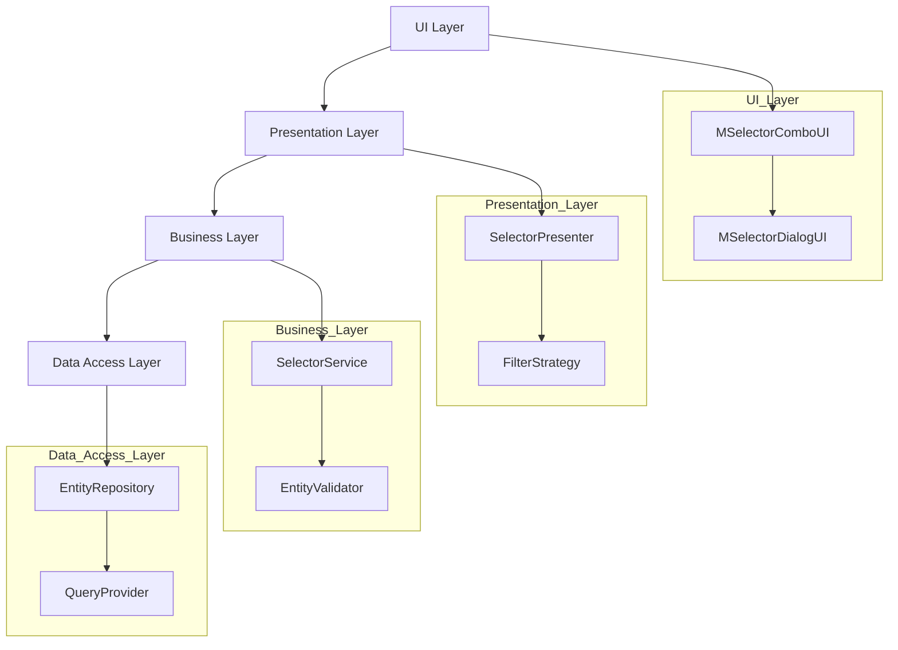
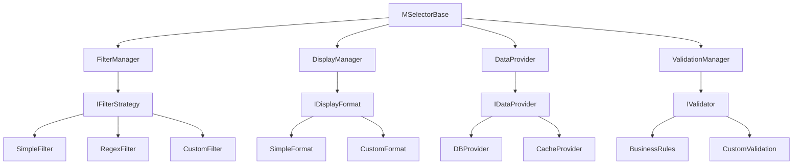

# Размышления о новом подходе к селекторам

## Ключевые проблемы текущей реализации

1. **Сильная связанность**
   - UI напрямую работает с базой данных
   - Логика фильтрации смешана с UI
   - Прямая зависимость от ADO
   - Бизнес-логика в UI-компонентах

2. **Дублирование кода**
   - Каждый селектор содержит похожий код
   - SQL-запросы копируются между селекторами
   - Логика фильтрации дублируется

3. **Сложность поддержки**
   - Изменение логики требует правки множества мест
   - Сложно добавить новое поведение
   - Отсутствие единого места для изменений

## Предлагаемые улучшения

### 1. Разделение ответственности



### 2. Абстракции и интерфейсы

```cpp
// Интерфейс селектора
class IMSelector {
    virtual void SetFilter(const IFilterCriteria& criteria) = 0;
    virtual void SetDisplayFormat(const IDisplayFormat& format) = 0;
    virtual void SetDataProvider(const IDataProvider& provider) = 0;
    virtual void SetValidator(const IValidator& validator) = 0;
};

// Интерфейс фильтрации
class IFilterStrategy {
    virtual bool Apply(const IEntity& entity, const IFilterCriteria& criteria) = 0;
};

// Интерфейс отображения
class IDisplayFormat {
    virtual CString Format(const IEntity& entity) = 0;
};
```

### 3. Ключевые свойства нового подхода

1. **Конфигурируемость**
   ```cpp
   // Пример конфигурации селектора
   selector
       .WithDataProvider(std::make_shared<EntityDataProvider>())
       .WithFilter(std::make_shared<CustomFilter>())
       .WithValidator(std::make_shared<BusinessRuleValidator>())
       .WithDisplayFormat(std::make_shared<CustomFormat>());
   ```

2. **Расширяемость**
   ```cpp
   // Добавление нового поведения через декораторы
   auto baseSelector = std::make_shared<BaseSelector>();
   auto withCache = std::make_shared<CachingDecorator>(baseSelector);
   auto withLogging = std::make_shared<LoggingDecorator>(withCache);
   ```

3. **Переиспользуемость**
   ```cpp
   // Общие компоненты для всех селекторов
   class SelectorBase : public IMSelector {
       std::shared_ptr<IFilterStrategy> m_filter;
       std::shared_ptr<IDisplayFormat> m_format;
       std::shared_ptr<IDataProvider> m_provider;
       std::shared_ptr<IValidator> m_validator;
   };
   ```

### 4. Предлагаемая структура



## Ключевые преимущества нового подхода

1. **Гибкость и расширяемость**
   - Легко добавлять новые типы фильтрации
   - Простое добавление новых форматов отображения
   - Возможность подмены компонентов

2. **Переиспользование кода**
   - Общая базовая функциональность
   - Общие стратегии фильтрации
   - Общие форматы отображения

3. **Улучшенная поддержка**
   - Изолированные изменения
   - Четкое разделение ответственности
   - Упрощенное тестирование

4. **Производительность**
   - Возможность кэширования
   - Ленивая загрузка данных
   - Оптимизация запросов

5. **Безопасность**
   - Централизованная валидация
   - Контроль доступа к данным
   - Защита от SQL-инъекций

## Рекомендации по реализации

1. **Постепенный переход**
   - Создать новую базовую структуру
   - Постепенно переводить существующие селекторы
   - Сохранить обратную совместимость

2. **Приоритеты рефакторинга**
   - Начать с разделения UI и бизнес-логики
   - Внедрить систему фильтрации
   - Реализовать кэширование
   - Добавить валидацию

3. **Технические аспекты**
   - Использовать умные указатели
   - Внедрить обработку ошибок
   - Добавить логирование
   - Реализовать unit-тесты

## Пример использования нового подхода

```cpp
// Создание селектора
auto selector = std::make_shared<AddressSelector>()
    .WithDataProvider(std::make_shared<AddressDataProvider>())
    .WithFilter(std::make_shared<AddressFilter>())
    .WithValidator(std::make_shared<AddressValidator>())
    .WithDisplayFormat(std::make_shared<AddressFormat>());

// Использование в UI
class CAddressSelectorUI : public CSelectorBaseUI {
private:
    std::shared_ptr<ISelector> m_selector;
    
public:
    void OnTextChanged(const CString& text) {
        auto criteria = FilterCriteria()
            .AddCondition("name", text)
            .SetMatchType(MatchType::Contains);
            
        m_selector->SetFilter(criteria);
    }
    
    void OnSelectionChanged() {
        if (auto selected = m_selector->GetSelected()) {
            // Обработка выбора
        }
    }
};
```

## Заключение

Новый подход к реализации селекторов должен фокусироваться на:
1. Чистой архитектуре с разделением ответственности
2. Гибкости и расширяемости
3. Переиспользовании кода
4. Производительности и безопасности
5. Удобстве поддержки и тестирования

Это позволит создать более надежную и масштабируемую систему, которую будет проще поддерживать и развивать в будущем.