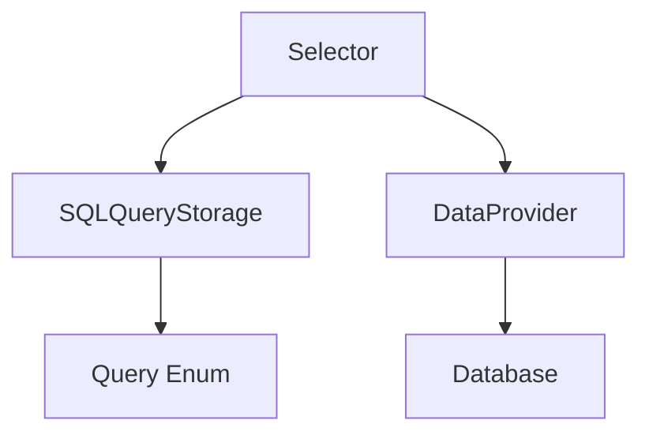

# Упрощенный подход к реализации селекторов

## Основная идея



## Базовая структура

```cpp
// В SQLQueries.h
enum class Querys {
    FileSelectorS,      // Запрос для выборки файлов
    DepartmentSelectorS, // Запрос для выборки подразделений
    // ... другие запросы
};

// Базовый шаблонный класс селектора
template<Querys TQuery>
class Selector {
private:
    int m_iSelectedID;
    CMConnection* m_pDBConnection;

public:
    Selector(int defaultID = -1) : m_iSelectedID(defaultID) {}
    
    void Init(CMConnection* pConnection) {
        m_pDBConnection = pConnection;
        LoadData();
    }

    void LoadData() {
        // Получение SQL из хранилища запросов
        auto sql = SQLQueryStorage::GetQuery(TQuery);
        // Выполнение запроса и заполнение комбобокса
    }
};
```

## Примеры использования

### 1. Простой селектор файлов

```cpp
// В диалоге
class CFileDialog : public CDialog {
private:
    Selector<Querys::FileSelectorS> m_FileSelector;

public:
    void OnInitDialog() {
        m_FileSelector.Init(GetDBConnection());
    }
};
```

### 2. Селектор с параметрами

```cpp
// Специализация для конкретного запроса
template<>
class Selector<Querys::DepartmentSelectorS> {
public:
    void SetParentID(int parentID) {
        // Получение параметризованного SQL
        auto sql = SQLQueryStorage::GetQuery(Querys::DepartmentSelectorS);
        sql.ReplaceParam(":ParentID", parentID);
        // Обновление данных
    }
};

// Использование
auto deptSelector = new Selector<Querys::DepartmentSelectorS>();
deptSelector->SetParentID(100);
```

## Хранение SQL запросов

```cpp
// В SQLQueryStorage.h
class SQLQueryStorage {
public:
    static CString GetQuery(Querys query) {
        switch(query) {
            case Querys::FileSelectorS:
                return _T("SELECT ID, Name, Path FROM Files WHERE Deleted = 0");
            case Querys::DepartmentSelectorS:
                return _T("SELECT ID, Name FROM Departments WHERE ParentID = :ParentID AND Deleted = 0");
            // ... другие запросы
        }
    }
};
```

## Преимущества подхода

1. **Простота**
   - Минимум абстракций
   - Понятная структура
   - Легко внедрить

2. **Типобезопасность**
   - Запросы определены в enum
   - Компиляция не пройдет с неверным запросом

3. **Централизация SQL**
   - Все запросы в одном месте
   - Легко найти и изменить
   - Возможность оптимизации

4. **Гибкость**
   - Легко добавить новые селекторы
   - Простое расширение функциональности

## Пошаговая реализация

1. **Определение запросов**
```cpp
// SQLQueries.h
enum class Querys {
    FileSelectorS,
    DepartmentSelectorS,
    PersonSelectorS,
    // ...
};
```

2. **Создание хранилища запросов**
```cpp
// SQLQueryStorage.h
class SQLQueryStorage {
public:
    static CString GetQuery(Querys query);
    static CString GetQueryWithParams(Querys query, const map<CString, CString>& params);
};
```

3. **Базовый класс селектора**
```cpp
template<Querys TQuery>
class Selector {
protected:
    CComboBoxEx* m_pCombo;
    CMConnection* m_pDBConnection;
    int m_iSelectedID;

public:
    void Init(CComboBoxEx* pCombo, CMConnection* pConnection) {
        m_pCombo = pCombo;
        m_pDBConnection = pConnection;
        LoadData();
    }

    virtual void LoadData() {
        auto sql = SQLQueryStorage::GetQuery(TQuery);
        ExecuteQuery(sql);
    }

protected:
    void ExecuteQuery(const CString& sql) {
        // Выполнение запроса и заполнение комбобокса
        _RecordsetPtr pRS;
        // ... стандартный код работы с ADO
    }
};
```

4. **Специализированные селекторы**
```cpp
// Селектор файлов
class FileSelector : public Selector<Querys::FileSelectorS> {
    // Специфичная для файлов логика
};

// Селектор подразделений с параметрами
class DepartmentSelector : public Selector<Querys::DepartmentSelectorS> {
public:
    void SetParentID(int parentID) {
        map<CString, CString> params;
        params[_T(":ParentID")] = ToString(parentID);
        auto sql = SQLQueryStorage::GetQueryWithParams(Querys::DepartmentSelectorS, params);
        ExecuteQuery(sql);
    }
};
```

## Дальнейшее развитие

1. **Добавление фильтрации**
```cpp
template<Querys TQuery>
class Selector {
public:
    void SetFilter(const CString& filter) {
        auto sql = SQLQueryStorage::GetQuery(TQuery);
        if (!filter.IsEmpty()) {
            sql += _T(" AND Name LIKE '%") + filter + _T("%'");
        }
        ExecuteQuery(sql);
    }
};
```

2. **Кэширование данных**
```cpp
template<Querys TQuery>
class Selector {
private:
    vector<EntityPtr> m_cachedData;

public:
    void LoadData() {
        if (m_cachedData.empty()) {
            // Загрузка из базы
        }
        FillComboFromCache();
    }
};
```

3. **Обработка событий**
```cpp
template<Querys TQuery>
class Selector {
public:
    void OnSelChange() {
        int iCurSel = m_pCombo->GetCurSel();
        if (iCurSel != CB_ERR) {
            m_iSelectedID = (int)m_pCombo->GetItemData(iCurSel);
            NotifySelectionChanged();
        }
    }
};
```

## Заключение

Этот упрощенный подход:
1. Сохраняет существующую функциональность
2. Улучшает организацию кода
3. Добавляет типобезопасность
4. Централизует SQL-запросы
5. Создает основу для дальнейших улучшений

При этом он достаточно прост для быстрого внедрения и не требует масштабного рефакторинга существующего кода.