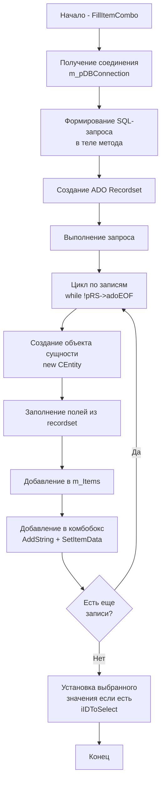
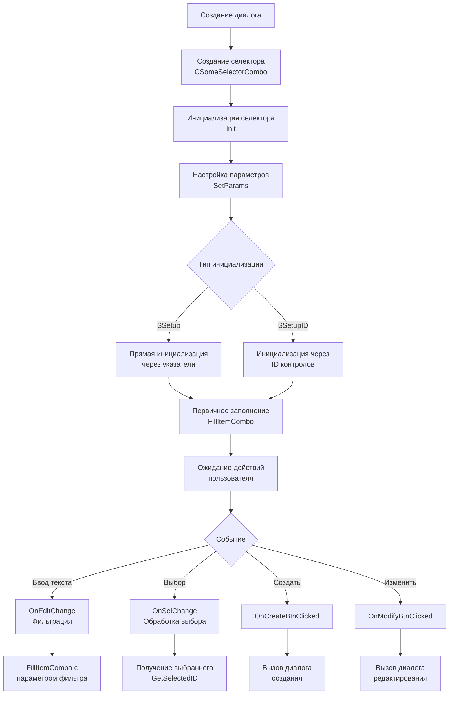

# Селекторы MERP (старая реализация)

## 1. Схема заполнения селектора данными



## 2. Описание работы схемы заполнения

### Основные методы и их роль:

#### FillItemCombo
```cpp
void CSomeSelectorCombo::FillItemCombo(LPCTSTR pStr = nullptr, int iIDToSelect = -1)
{
    // Очистка предыдущих данных
    ClearItems();
    m_pCombo->ResetContent();

    // Формирование SQL-запроса
    CString sSQL;
    sSQL.Format(_T("SELECT ID, Name, Code FROM SomeTable WHERE Deleted = 0"));
    if (pStr && _tcslen(pStr))
        sSQL.AppendFormat(_T(" AND Name LIKE '%%%s%%'"), pStr);

    // Выполнение запроса через ADO
    _RecordsetPtr pRS;
    pRS.CreateInstance(__uuidof(Recordset));
    pRS->Open(sSQL.AllocSysString(), 
              m_pDBConnection->GetActiveConnection().GetInterfacePtr(),
              adOpenStatic, adLockOptimistic, adCmdText);
}
```

#### Создание и заполнение объектов
```cpp
while (!pRS->adoEOF)
{
    // Создание объекта
    CSomeEntity* pEntity = new CSomeEntity();
    
    // Заполнение полей
    pEntity->m_iID = (int)pRS->Fields->GetItem("ID")->Value;
    pEntity->m_sName = (LPCTSTR)(_bstr_t)pRS->Fields->GetItem("Name")->Value;
    
    // Добавление в список
    m_Items.push_back(pEntity);
    
    // Добавление в комбобокс
    int iIndex = m_pCombo->AddString(pEntity->GetDisplayName());
    m_pCombo->SetItemData(iIndex, (DWORD_PTR)pEntity->m_iID);
    
    pRS->MoveNext();
}
```

## 3. Схема использования селектора в приложении



## 4. Описание схемы использования

### Инициализация селектора
```cpp
// В конструкторе диалога
m_SomeSelector.Init(SSetupID(
    this,                   // владелец
    IDC_BTN_CREATE,        // ID кнопки создания
    IDC_BTN_MODIFY,        // ID кнопки изменения
    IDC_BTN_DELETE,        // ID кнопки удаления
    IDC_COMBO_SELECTOR,    // ID комбобокса
    pDBConnection          // соединение с БД
));
```

### Обработка событий
```cpp
// Обработка изменения текста
void CSomeSelectorCombo::OnEditChange()
{
    CString sText;
    m_pCombo->GetWindowText(sText);
    FillItemCombo(sText);
}

// Обработка выбора
void CSomeSelectorCombo::OnSelChange()
{
    int iCurSel = m_pCombo->GetCurSel();
    if (iCurSel != CB_ERR)
    {
        int iSelectedID = (int)m_pCombo->GetItemData(iCurSel);
        // Дополнительная обработка выбора
    }
}

// Создание нового элемента
void CSomeSelectorCombo::OnCreateBtnClicked()
{
    CSomeDialog dlg;
    if (dlg.DoModal() == IDOK)
    {
        // Обновление списка
        FillItemCombo();
    }
}
```

### Получение выбранного значения
```cpp
int CSomeSelectorCombo::GetSelectedID()
{
    int iCurSel = m_pCombo->GetCurSel();
    if (iCurSel != CB_ERR)
        return (int)m_pCombo->GetItemData(iCurSel);
    return m_iInvalidID;
}
```

### Основные проблемы старого подхода:

1. **Прямой SQL в коде**
   - SQL-запросы написаны непосредственно в методах
   - Сложность поддержки и изменения запросов
   - Отсутствие переиспользования запросов

2. **Жесткая привязка к ADO**
   - Прямое использование ADO Recordset
   - Сложность замены технологии доступа к данным

3. **Дублирование кода**
   - Каждый селектор содержит похожий код
   - Высокая вероятность ошибок при копировании

4. **Отсутствие абстракции**
   - Нет разделения на слои доступа к данным
   - Смешивание UI-логики и работы с данными

5. **Ручное управление памятью**
   - Необходимость явного удаления объектов
   - Возможность утечек памяти