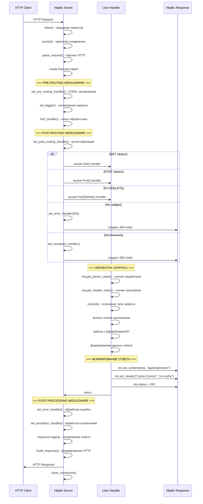

# Схема работы cpp-httplib

## Основные структуры

### Классы

**httplib::Server** — HTTP сервер
- Методы: `Get()`, `Post()`, `Put()`, `Delete()` для регистрации обработчиков
- `listen()` — запуск сервера на порту
- `set_mount_point()` — статические файлы

**httplib::Client** — HTTP клиент  
- Методы: `Get()`, `Post()`, `Put()`, `Delete()` для запросов
- Конструктор принимает базовый URL
- Поддержка HTTPS через `httplib::SSLClient`

### Структуры данных

**httplib::Request** — входящий запрос
```cpp
std::string method;        // GET, POST, etc.
std::string path;          // путь запроса
httplib::Headers headers;  // заголовки
std::string body;          // тело запроса
httplib::Params params;    // параметры URL
```

**httplib::Response** — ответ сервера
```cpp
int status;               // HTTP статус (200, 404, etc.)
httplib::Headers headers; // заголовки ответа  
std::string body;         // тело ответа
void set_content();       // установка контента
```

**httplib::Result** — результат клиентского запроса
```cpp
auto res = client.Get("/api");
if (res && res->status == 200) {
    std::cout << res->body;
}
```

**httplib::Headers** — контейнер заголовков (std::multimap)
**httplib::Params** — параметры запроса (std::multimap)

## Диаграмма обработки запроса



## Таблица хендлеров

| Хендлер | Момент выполнения | Назначение | Возвращаемое значение |
|---------|-------------------|------------|----------------------|
| **set_pre_routing_handler()** | До поиска маршрута | CORS, валидация, логирование входящих запросов | `HandlerResponse::Handled/Unhandled` |
| **set_post_routing_handler()** | После поиска, до вызова handler'а | Аутентификация, авторизация | `HandlerResponse::Handled/Unhandled` |
| **Get/Post/Put/Delete()** | Основная обработка | Бизнес-логика приложения | `void` |
| **set_error_handler()** | При HTTP ошибках (404, 500, etc.) | Кастомные страницы ошибок | `void` |
| **set_exception_handler()** | При C++ исключениях | Обработка неперехваченных исключений | `void` |
| **set_logger()** | После отправки ответа | Логирование запросов и ответов | `void` |
| **set_mount_point()** | При запросе статических файлов | Раздача статического контента | Автоматическая |

## Примеры использования

### Pre-routing Handler
```cpp
server.set_pre_routing_handler([](const Request& req, Response& res) {
    res.set_header("Access-Control-Allow-Origin", "*");
    std::cout << "Request: " << req.method << " " << req.path << std::endl;
    return Server::HandlerResponse::Unhandled; // продолжить
});
```

### Post-routing Handler  
```cpp
server.set_post_routing_handler([](const Request& req, Response& res) {
    if (!check_auth(req.get_header_value("Authorization"))) {
        res.status = 401;
        return Server::HandlerResponse::Handled; // прервать
    }
    return Server::HandlerResponse::Unhandled; // продолжить
});
```

### Main Handlers
```cpp
server.Get("/api/users", [](const Request& req, Response& res) {
    res.set_content(get_users_json(), "application/json");
});

server.Post("/api/login", [](const Request& req, Response& res) {
    auto token = authenticate(req.body);
    res.set_content(token, "text/plain");
});
```

### Error Handler
```cpp
server.set_error_handler([](const Request&, Response& res) {
    if (res.status == 404) {
        res.set_content("Page not found", "text/html");
    }
});
```

### Exception Handler
```cpp
server.set_exception_handler([](const Request&, Response& res, std::exception& e) {
    res.status = 500;
    res.set_content("Server error: " + std::string(e.what()), "text/plain");
});
```

### Logger
```cpp
server.set_logger([](const Request& req, const Response& res) {
    printf("[%s] %s %s -> %d\n", 
           get_timestamp().c_str(), req.method.c_str(), 
           req.path.c_str(), res.status);
});
```

### Static Files
```cpp
server.set_mount_point("/static", "./public");
// Теперь /static/image.jpg -> ./public/image.jpg
```

## Порядок выполнения

1. **set_pre_routing_handler** 
2. Поиск маршрута
3. **set_post_routing_handler**
4. **Get/Post/Put/Delete** (основной handler)
5. **set_error_handler** (если ошибка)
6. **set_exception_handler** (если исключение)
7. **set_logger** (всегда в конце)

## Ключевые методы в процессе обработки

### Серверная сторона:
1. **`Server::listen(host, port)`** — запуск сервера
2. **`Server::process_request()`** — внутренний метод обработки
3. **`Server::routing()`** — поиск подходящего обработчика
4. **Пользовательский handler** — ваша функция `[](const Request& req, Response& res){}`

### Методы Request:
- **`req.method`** — получение HTTP метода
- **`req.path`** — получение пути
- **`req.get_header_value()`** — чтение заголовков
- **`req.get_param_value()`** — чтение параметров

### Методы Response:
- **`res.set_content(content, type)`** — установка тела ответа
- **`res.set_header(key, value)`** — установка заголовков
- **`res.status = code`** — установка статуса

## Пример полного handler'а

```cpp
server.Post("/api/users", [](const httplib::Request& req, httplib::Response& res) {
    // 1. Извлечение данных
    auto user_data = req.body;
    auto auth_header = req.get_header_value("Authorization");
    
    // 2. Бизнес-логика  
    if (!validate_token(auth_header)) {
        res.status = 401;
        return;
    }
    
    auto user = create_user_from_json(user_data);
    auto user_id = database.save_user(user);
    
    // 3. Формирование ответа
    json response = {{"id", user_id}, {"status", "created"}};
    res.set_content(response.dump(), "application/json");
    res.status = 201;
});
```